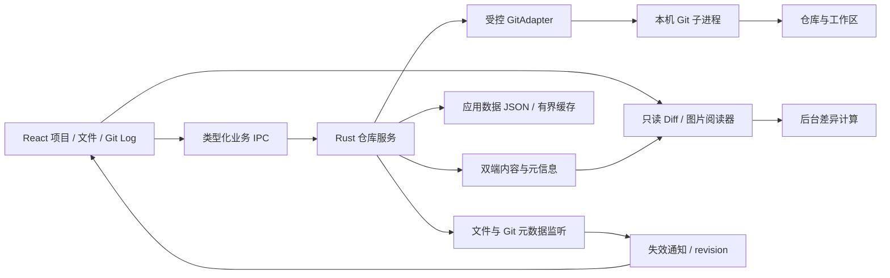

# Oris V1 技术方案

状态：已确认主栈 + 有边界的工程设计；CodeMirror 具体适配方式待任务 01 验证。

## 1. 平台与栈

| 层 | 选择 | 责任 |
| --- | --- | --- |
| 桌面外壳 | Tauri 2 | 窗口、系统集成、IPC、安装包 |
| 后端 | Rust | Git 子进程、读取/比较请求、路径与权限边界、监听、应用数据 |
| 前端 | React + TypeScript + Vite | 项目/文件/历史 UI 与交互状态 |
| 文本阅读 | CodeMirror 6 候选 | 只读文本、语法高亮、选择、搜索、折叠与 diff 适配 |
| Git | 本机 Git CLI | 仓库语义、状态、对象、refs、历史、显式 fetch |
| 持久化 | 用户应用数据目录中的版本化 JSON | 项目列表、设置、浏览状态；无 V1 数据库/内容索引 |

Win11 x64 使用 WebView2，macOS 14+ arm64 使用 WKWebView。macOS 硬件从 M1 起，无 x86_64/Universal 构建。依赖具体版本在任务 01 按实际兼容性选定并锁定，不在未运行时编造版本已兼容。

## 2. 模块与调用关系

React 不接收通用 shell、任意文件写入或任意命令执行能力。所有业务请求由 Rust 校验并执行。Tauri command 入口本身不保证后台执行，Git 等待、目录读取和计算必须离开 UI 线程。

## 3. 业务对象契约

| 对象 | 必需信息与约束 |
| --- | --- |
| Repository | 稳定 RepoId、展示路径、规范化工作树路径、gitDir、commonDir；适配 `.git` 目录/文件，不自行猜测 |
| Endpoint | Head/Index/WorkingTree/EmptyTree/Commit(OID)/ConflictStage(1/2/3, OID)；ref 先解析 OID，不能把字符串直接当命令参数 |
| CompareRequest | RepoId、左/右端点、比较模式、路径标识、选项、requestId、revision |
| FileChange | 独立旧/新路径、状态、是否二进制、可得的增删统计、重命名检测信息 |
| ContentPair | 左右文本/受控图片载荷或有理由的不可用状态；区分不存在、已有空内容、失败和超预算；编码/EOL/大小、内容标识、对应端点与 revision |
| DiffDocument | 来源 contentId、空白规则、行级块、词级区间、导航锚点、完整/降级状态 |
| Commit | OID、parents、作者/提交者/时间、message、相关 refs；排序与拓扑身份分开 |
| TrackingStatus | localOID、upstreamRef/upstreamOID、ahead/behind 或原因、最后可信获取时间 |
| ViewState | RepoId、视图、端点、选中文件、行/hunk 锚点、布局；不默认存代码内容 |

路径展示字符串与内部可逆标识分开，处理 Git `-z` 输出、特殊字符与不可解码字节。不按换行或普通空格拆文件列表。

请求返回必须带原 requestId/RepoId/revision，前端只接受当前选择对应的结果。变更发生在内容读取期间时判定过期/需刷新，不将混合版本显示为一个稳定 diff；V1 不实现事务性文件系统快照。

## 4. GitAdapter

- 自动发现本机 Git，支持用户指定可执行文件，验证版本及所需能力。Finder 启动的 macOS 应用不依赖交互 shell 的 PATH；缺失时提示设置，不自动触发 Xcode/开发工具安装。
- 参数数组直接启动进程，不经过 shell；固定工作目录、限定命令模板，ref 解析为 OID，路径使用明确分隔及原始标识。
- 使用适合程序读取的稳定输出，例如 status porcelain v2 + NUL 分隔；旧 Git 缺必需能力时明确不支持，不以不可靠文本猜测。
- 分页读取历史；避免 N 个文件启动 N 次 git。对象读取可批量，但不先构建复杂常驻服务。
- 普通读取避免可选锁/索引刷新，禁用外部 diff、textconv、fsmonitor 可执行钩子等非必要调用，并控制相关配置。只读命令名不等于零副作用保证，需仓库前后验证。
- 不自动修改 safe.directory 或用户 Git 配置。所有权不受信任时清楚说明并停止。
- 区分退出状态：Git 某些比较模式的“存在差异”退出码不是执行失败；stderr 保留有用摘要，不将敏感认证信息写入常规日志。
- shallow/缺失对象等不能完整比较的情况显式报错；不自动补拉历史或修复仓库。

## 5. Diff 计算与展示

Git 决定文件集合、比较端点与真实内容。文件列表的 Git 增删统计是来源统计；阅读器在选定空白规则下的差异数是显示统计，两者需要明确区分。

CodeMirror 及其 merge 能力先做可行性验证；采用其 diff 或独立计算器的具体方式由任务 01 记录。必须保证当前阅读器的高亮、连接带、计数、导航都来自同一个 DiffDocument，不能由不同算法各自推断。

语法高亮按语言按需加载，不启动语言服务器或完整 IDE 服务。文本组件显式只读，不把 React 状态变更映射为整份编辑器重建。后台差异计算的线程/Worker 集成属于任务 01 验证，不声称现成组件自动把所有计算移出主线程。

行高变化、软换行、折叠、滚动与字体缩放后重新测量对应区间；中央连接带仅装饰比较关系，不提供应用差异操作。不能依赖私有 DOM 补丁作为长期方案而不记录升级风险。

任务 03 仅增补两条读取路径：静态 PNG/JPEG/WebP 按签名/尺寸/字节预算预检后解码；冲突按 `ls-files --unmerged -z` 的真实 mode/OID/stage 获取原始 blob，并独立读取工作区。默认 stage 2→3，按需选择 Base/WT；不依冲突标记推断，不常驻四个完整版本，rebase 时不武断标“我的/远端”。

图片共用画布坐标、等比缩放及透明背景，新增删除沿用单栏；切换释放图片资源并丢弃过期结果。一侧解码失败保留另一侧，不能把失败当空文件或无差异。仅增加上述必要状态与端点，不引入完整编码、LFS/submodule 解析或通用格式平台；特殊 mode 拒绝不安全的普通文件读取。原始对象不执行 filters/textconv，普通读取沿用只读边界。

## 6. 调度、缓存和监听

- 当前可见仓库和文件优先；有界并发；切项目取消可取消工作并抛弃过期结果。
- 项目状态与文本 model 缓存分开；小型浏览状态长留，大内容按预算淘汰。项目数量不能线性增加完整编辑器实例和常驻模型。
- 历史/文件列表虚拟化，历史图只绘制当前已加载范围及必要边缘关系。
- Git 对象以 OID 缓存；WorkingTree/Index 以 revision/内容标识失效，mtime 不是充分的永恒一致性证明。
- 文件监听覆盖当前仓库工作区与相关 gitDir/commonDir 元数据；合并事件，忽略 Oris 自己的应用数据。失焦停止高频工作，回到前台补核对；手动刷新永远可用。
- 普通失败不自动反复重试。并发上限、内容预算由任务 01/06 实测固定；新增图片预算由 03 在执行前固定，避免预建调度平台。

## 7. 只读边界与 fetch

- 浏览路径允许读取已选仓库及 Git 必需对象，不允许从前端任意读取系统文件。符号链接作为仓库条目处理，不借此跟随读取任意外部内容。
- CSP/IPC 权限最小化，渲染器不加载远程代码；仓库 HTML/SVG 不能作为应用内容执行。图片解码设置字节和像素预算。
- 普通 Git 读取禁用不必要的外部程序；fetch 单独路径允许使用用户既有 SSH/凭据设施，因此不能对它做“完全不执行外部程序”的虚假承诺。
- fetch 仅通过专用入口，禁止由刷新、项目切换、应用启动隐式调用。禁 prune、禁止递归子模块、禁不必要自动维护；不执行 pull/push。
- 不保存凭据，不记录凭据值；认证设施无法工作时给清晰错误。V1 不自建账号系统或复杂交互式终端认证。
- fetch 取消/失败可能已更新部分 Git 元数据，不承诺原子回滚；重新读取实际 refs 并准确报告。

## 8. 持久化与发布

项目/偏好/浏览状态采用小型版本化 JSON，基础安全写入；损坏配置给可理解提示，不增加多代备份恢复体系。缓存写入应用缓存目录，不写入仓库。

Windows 构建/测试于 Windows，macOS arm64 构建/测试于 macOS；不能以 Chromium 浏览器通过替代 WKWebView 通过。安装包处理 WebView2 依赖；Mac 发布需签名、公证及正确的 arm64 依赖。证书不写仓库，由受控发布环境提供。

V1 不提供自动更新服务。没有签名资源可交付明确标记的内部测试包，但不能把它记为正式发布验收通过。

## 9. 官方依据与验证边界

- [Tauri 进程模型](https://v2.tauri.app/concept/process-model/)、[权限能力](https://v2.tauri.app/security/capabilities/)、[分发](https://v2.tauri.app/distribute/)、[macOS 签名](https://v2.tauri.app/distribute/sign/macos/)。
- [CodeMirror merge](https://github.com/codemirror/merge)（官方仓库说明已迁移，实施以其指向的当前源码为准）、[Monaco](https://github.com/microsoft/monaco-editor)。
- [git-status](https://git-scm.com/docs/git-status)、[git-diff](https://git-scm.com/docs/git-diff)、[git-fetch](https://git-scm.com/docs/git-fetch)。

上述方案是工程设计，不代表已经证明快于 Electron、达到内存预算或还原所有 JetBrains 行为。任务 01 提供选型证据，任务 06 提供发布规模证据。
