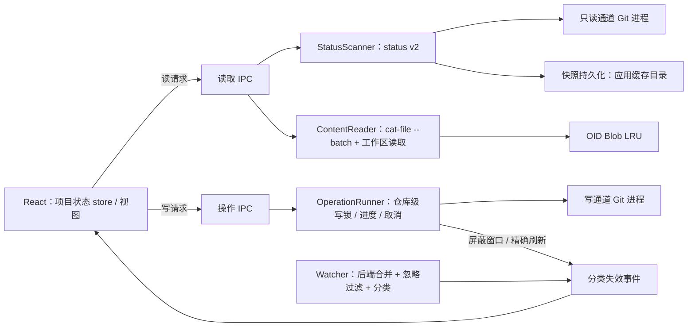

# Oris V2 技术方案

状态：工程设计，尚未实施。所有收益和预算都需要任务 V2-01 实测确认。主栈沿用 [V1 技术方案](v1-architecture.md)；本文描述二期的增量与修订。

## 1. 现状瓶颈（依据 2026-09-23 的 main 分支代码）

| # | 现状 | 影响 |
| --- | --- | --- |
| 1 | 每次快照刷新串行启动 4 个 Git 进程（`diff --name-status`、`ls-files --others`、`ls-files --unmerged`、`diff --numstat`），而且只覆盖一个比较范围（`git.rs` `list_changes` / `populate_stats`） | Windows 上 Git for Windows 每个进程要几十毫秒；切换比较范围时重新扫描。V1 实测 5 仓库 × 100 文件的未缓存重读 P50 为 663 ms |
| 2 | 内容读取经过全局 `READ_SERIAL` 互斥锁，所有仓库的读取排成一队（`lib.rs`） | 无法并行预取；一个慢仓库拖住所有仓库 |
| 3 | 每读一侧内容就启动一个 Git 进程 | 切换文件的时延被进程启动开销主导 |
| 4 | watcher 对整个 worktree 递归监听，每个事件都 emit 到前端，由前端做 300 ms 合并 | 构建、`node_modules` 安装时出现事件风暴，被忽略的路径也会触发刷新 |
| 5 | 普通读取带 `--no-optional-locks`，status 不回写 index 的 stat 缓存 | stat 信息变“脏”的文件每次刷新都要重新读取并计算哈希，大仓库会持续变慢 |
| 6 | 前端内容缓存以 `repo/scope/revision/path` 为键，revision 变化就清空整个仓库的缓存 | 任何 Git 操作之后，未变化文件的缓存也全部失效 |
| 7 | `App.tsx` 一个组件内有 30 多个 `useState` | 切换时大面积重渲染 |

## 2. 总体结构

## 3. 读写两条执行通道

- **只读通道**：保留 V1 的全部参数（`--no-optional-locks`、`core.fsmonitor=false`、禁用 external diff/textconv、`GIT_TERMINAL_PROMPT=0`、`GIT_LITERAL_PATHSPECS=1` 等）。浏览、刷新、切换只能走这个通道。
- **写通道**：只由 OperationRunner 调用，命令模板固定（见 §6），不接受前端传入任意参数。
  - 去掉 `--no-optional-locks`，允许使用 credential helper 与 ssh-agent，允许 hooks 与 LFS 等 filter 运行（与用户在终端执行 git 时的行为一致）。
  - 继续禁用 external diff/textconv，继续设置 `GIT_TERMINAL_PROMPT=0`。
  - **强制非交互**：所有需要消息的命令都通过 `-F -`（stdin）或 `--no-edit` 提供消息，同时把 `GIT_EDITOR`、`GIT_SEQUENCE_EDITOR` 设置为立即返回的空操作，防止任何命令卡在编辑器上。
  - **路径**：用 `--pathspec-from-file=- --pathspec-file-nul` 传递，避免命令行长度限制和特殊字符问题（Git ≥ 2.26，在最低版本 2.31 之内）。
  - **分支名**：先用 `git check-ref-format --branch` 校验，ref 解析为 OID 后再使用。
- 两条通道共用 Git 可执行文件发现与版本检测。`git --version` 的结果按“可执行文件路径 + mtime”缓存，不再每打开一个仓库都执行一次。

## 4. OperationRunner（写操作）

- **仓库级写锁**：同一仓库同时只运行一个写操作；另一个写请求直接拒绝（不排队），前端对应入口不可用。读取不受写锁阻塞，但操作期间产生的读结果会带上 revision，过期结果由 RequestGate 丢弃。
- **操作描述**：`{ kind, repoId, 模板参数, 确认等级, 影响维度 }`。影响维度为 `status` / `refs` / `head` / `stash` / `inProgress` 的组合，决定操作结束后刷新哪些部分。
- **watcher 屏蔽窗口**：操作开始时记录屏蔽标记，操作期间该仓库的 watcher 事件只做合并，不下发；操作结束后按影响维度做一次精确刷新，再解除屏蔽。
- **进度与取消**：pull、push、fetch 带 `--progress`，逐行解析 stderr，经 Tauri Channel 推送到前端。取消时终止整个进程树（Windows 使用 Job Object，macOS 使用进程组）。取消或失败之后，重新读取 refs 与 status，并如实报告实际状态。
- **超时**：网络操作设置“无输出超时”（初始 60 s）；hooks 不设超时，但可以取消。超时后终止进程，提示用户可能需要先在终端完成首次主机认证或凭据配置（V2-D12）。
- **外部锁**：检测到 `index.lock` 等锁文件导致的失败时，给出明确说明，不重试、不删除锁文件。
- **乐观更新**：stage、unstage 在前端立即移动条目，同时标记“确认中”；返回失败时回滚并提示。其他写操作不做乐观更新。
- **进行中状态检测**：读取 `MERGE_HEAD`、`rebase-merge/`、`rebase-apply/`、`CHERRY_PICK_HEAD`、`REVERT_HEAD`、`BISECT_LOG`，结果放进快照的 `inProgress` 字段。merge 以外的进行中状态会禁用全部写操作。
- **操作记录**：每个仓库只保留最近一次操作的完整输出（有字节上限），供状态栏展开查看，不写日志文件。凭据相关的输出在展示前做脱敏处理。

## 5. 数据层与流畅度

### 5.1 一次 status 覆盖三个比较范围

- 用 `git status --porcelain=v2 -z --branch --untracked-files=all --find-renames` 替换现有的 4 条命令。每个条目的 XY 状态分别对应“已暂存”（HEAD→index）和“未暂存”（index→工作区）；未跟踪（`?`）、冲突（`u`）各自独立；`--branch` 同时给出 HEAD OID、分支、上游、ahead/behind。
- 每个条目自带 HEAD 与 index 两侧的 OID，内容读取可以直接按 OID 取对象，不再需要按路径解析。
- **“全部本地改动”范围的 rename**：status v2 只识别 index 中的 rename（HEAD→index）。仅存在于工作区的 rename（未暂存删除 + 未跟踪新增）不会配对，而 V1 的 `diff HEAD --find-renames` 会配对。处理方式：只在显示“全部”范围时，懒执行一次 `diff HEAD --name-status -M -z` 修正配对，结果按 revision 缓存，保持与 V1 语义一致。
- **增删统计改为后台补齐**：文件列表先显示，统计随后用 `diff --numstat`（未暂存、已暂存两次，可并行）填充；“全部”范围的统计在首次显示时补齐。统计未到之前显示占位，不能显示为 0。
- **revision 重新定义**：仓库级 revision = hash(status v2 原始输出 + HEAD/refs 内容)，三个范围共享同一个 revision。切换范围不产生新的 Git 调用。

### 5.2 ContentReader

- 每个活跃仓库常驻一个 `git cat-file --batch` 进程（走只读通道参数），按 OID 读取 blob。进程生命周期：按需启动，空闲 60 s 关闭，全局最多 5 个（跟随项目 LRU）；进程异常退出时，下一次请求重新启动一次；重启仍失败则报告错误，不循环重试。
- 工作区一侧直接读取文件系统；用 `(size, mtime)` 快速判断文件是否变化，读取之后计算内容哈希作为 contentId。
- 去掉全局 `READ_SERIAL`，改为每个仓库一个读取队列：cat-file 天然串行，工作区读取的并发上限为 2。取消使用每个仓库独立的 generation 计数。
- 冲突 stage（V1 任务 03）的 OID 来自 status v2 的 `u` 条目，也经 ContentReader 读取，不再单独起进程。
- 大内容通过 `tauri::ipc::Response` 或 Channel 以二进制传输，避免 JSON 字符串转义造成的膨胀。

### 5.3 缓存分层

| 层 | 键 | 内容 | 上限（初始） | 失效方式 |
| --- | --- | --- | --- | --- |
| 后端 BlobCache | OID | blob 原始字节 | 全局 32 MiB，按字节 LRU；单个 blob > 4 MiB 不进缓存 | OID 是内容寻址，不需要失效，只做淘汰 |
| 前端 DiffCache | (leftContentId, rightContentId, 阅读选项) | DiffDocument 与解码后的文本 | 16 MiB / 12 项（沿用 V1） | 只做 LRU 淘汰；不再因 revision 变化整仓清空 |
| 项目轻量状态 | RepoId | 文件列表、锚点、分支、inProgress | 每项目 ≤ 2 MiB | 以快照 revision 为准 |
| 持久化快照 | RepoId | 同上（不含文件内容） | 每项目 ≤ 2 MiB，最多 20 个项目 | 启动时校验（§5.5） |

- 同一份内容不在后端和前端各留一份完整拷贝：后端只缓存 blob 字节；前端只缓存当前文件和预取文件的解码文本，以及 DiffDocument。
- Git 操作之后，内容未变化的文件的 contentId 不变，缓存继续命中。

### 5.4 Watcher

- 在后端合并事件（`notify-debouncer-full`，初始窗口 200 ms），只下发合并后的分类结果。
- 忽略过滤：打开仓库时加载 gitignore 规则（`ignore` crate），被忽略的路径直接丢弃；`.git/objects`、`.git/logs`、`*.lock` 临时文件也忽略。
- 事件分类与刷新动作：

| 事件来源 | 刷新动作 |
| --- | --- |
| 工作区路径 | status（事件路径少于阈值时，带 pathspec 做局部 status） |
| `.git/index` | status |
| `HEAD`、`refs/`、`packed-refs` | status 的 branch 头信息 + 分支 / 日志视图 |
| `refs/stash` | stash 列表 |
| `MERGE_HEAD` 等进行中标记 | inProgress 状态 |

- 后台项目：收到事件只标记 dirty，不刷新；切回前台时才刷新。watcher 最多保留 5 个项目（LRU），超出的项目关闭 watcher，切回时做完整 status。
- Oris 自己的写操作期间使用屏蔽窗口（§4）；stat 缓存回写（§5.6）产生的 index 事件也要识别并跳过。

### 5.5 快照恢复（再次打开）

- 每次成功扫描之后，把轻量状态（文件列表、OID、分支、inProgress、阅读锚点）写入应用缓存目录，采用版本化 JSON，写入失败时忽略。
- 启动时先显示持久化的快照，状态为“校验中”；后台执行 status，完成后按 pathId 比较差异并替换，保持当前阅读位置。校验完成前所有写入口不可用（V2-D08）。
- 快照中选中文件的 diff：HEAD/index 两侧按 OID 读取，工作区一侧重新读取，所以不会用旧内容冒充新内容。

### 5.6 stat 缓存与 fsmonitor

- **stat 缓存回写（V2-D09）**：只在两个时机执行一次不带 `--no-optional-locks` 的 `git status`，让 Git 回写 index：Oris 写操作结束之后（刷新时顺带进行），以及用户手动刷新时。watcher 与聚焦触发的刷新保持不写。回写产生的 `.git/index` 事件要跳过。
- **fsmonitor（V2-D10）**：读取 `core.fsmonitor` 配置，只有值为布尔 true 且 Git ≥ 2.37 时，不再强制 `core.fsmonitor=false`；值为命令字符串时继续禁用。V1 A13 的安全用例需要扩展覆盖这一分支。实施条件：L 数据集实测证明 status 是瓶颈。

### 5.7 前端

- 按项目拆分状态 store（基于 `useSyncExternalStore` 的小型 store，不引入状态管理库），视图订阅细粒度切片，切换项目时不重建整棵树。
- 全应用只有一个 diff 编辑器实例：切换文件时替换文档与装饰，不重建编辑器（与 V1 D15 的双 `EditorView` 结构兼容）。
- 预取：当前文件确定之后，空闲时预取列表中上下相邻各 1 个文件（仅限 ≤ 256 KiB 的文本）。
- 连续切换：键盘连续切换文件时，只立即更新选中高亮；内容请求延迟 80 ms 发出，新的切换会取消未发出的请求。
- 文件列表超过 500 项时启用虚拟列表；stash 列表、分支列表同样虚拟化。

## 6. 写操作命令模板

| 操作 | 命令（写通道；路径一律经 `--pathspec-from-file=- --pathspec-file-nul`） |
| --- | --- |
| stage / 标记已解决 | `add` |
| unstage | `restore --staged`；空 HEAD 时 `rm --cached` |
| 丢弃（未暂存，已跟踪） | 备份后 `restore --worktree` |
| 丢弃（未跟踪） | 备份后由 Rust 删除文件（路径校验在 worktree 内；符号链接只删除链接本身） |
| 丢弃（全部范围） | 备份后 `restore --source=HEAD --staged --worktree`；index 中新增的文件为 `rm --cached` 后删除 |
| 撤销丢弃 | 从备份对象写回工作区；暂存部分用 `update-index --cacheinfo` 恢复 |
| hunk 暂存 / 取消 / 丢弃 | Rust 按原始字节生成 patch，`apply --cached` / `apply --cached --reverse` / `apply --reverse`，执行前先 `--check` |
| commit / amend | `commit -F -` / `commit --amend -F -`（仅并入暂存内容时用 `--no-edit`） |
| 撤销最近提交 | `reset --soft HEAD~1`；根提交时 `update-ref -d HEAD` |
| stash 保存 | `stash push [-u] [-m] [-- <paths>]` |
| stash 应用 / 弹出 / 删除 | 先核对 `stash@{n}` 仍指向列表中的 OID，再执行 `stash apply` / `pop` / `drop` |
| 新建 / 切换分支 | `branch <name> <oid>`、`switch <name>`、`switch -c <name> --track <remote>/<branch>` |
| 检出提交 | `switch --detach <oid>` |
| 重命名 / 删除分支 | `branch -m`；`branch -d`，未合并时经确认后 `branch -D` |
| 设置上游 | `branch --set-upstream-to=<remote>/<branch>` |
| pull | `pull --no-rebase --ff-only --progress` 或 `pull --no-rebase --no-ff --no-edit --progress`，均带 `--no-recurse-submodules` |
| push | `push --progress`；首次为 `push --progress -u <remote> <branch>` |
| merge / 中止 / 完成 | `merge --no-edit [--no-ff] <oid>`、`merge --abort`、`commit -F -` |
| 已推送判断 | `merge-base --is-ancestor HEAD @{u}`（只读通道） |

### discard 备份

- 丢弃前对工作区内容执行 `hash-object -w`，把内容写入仓库对象库（这是写操作的一部分）；暂存内容本来就已在对象库中，只记录其 OID 和 mode。
- 备份记录（路径、OID、mode、时间、操作 ID）写入应用数据目录，每个仓库最多保留 20 次操作。恢复前用 `cat-file -e` 确认对象仍然存在；对象已被 gc 清理时如实说明。
- 单个文件超过 50 MiB 时不备份，确认框标注“不可撤销”。

## 7. 资源上限（初始值，由 V2-01 实测后固定）

| 资源 | 上限 |
| --- | --- |
| 常驻 `cat-file --batch` 进程 | 5 个，空闲 60 s 关闭 |
| watcher | 5 个项目（LRU） |
| 同时运行的写操作 | 每仓库 1 个 |
| 后端 BlobCache | 32 MiB |
| 前端 DiffCache | 16 MiB / 12 项 |
| 快照持久化 | 每项目 2 MiB，最多 20 个项目 |
| 操作输出保留 | 每仓库最近 1 次，256 KiB |
| discard 备份记录 | 每仓库 20 次操作；单文件 50 MiB |

## 8. 安全边界

- V1 的 A13 用例继续有效：只读通道仍然不执行 external diff、textconv 或 fsmonitor 钩子命令。
- 写通道会执行 hooks 和 filter，与用户在终端中执行 git 的行为相同；这一点在发行说明中写明。
- 前端只能提交“操作描述”，Rust 负责参数构造、路径校验与 ref 解析，不提供通用的命令执行入口。
- 不保存凭据；操作输出展示前先脱敏（URL 中的用户名和密码）。
- 删除文件只允许发生在已校验的 worktree 路径内，不跟随符号链接。
