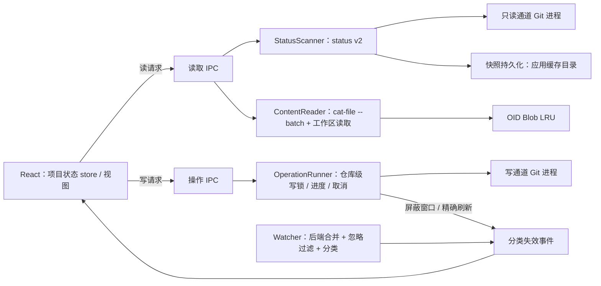
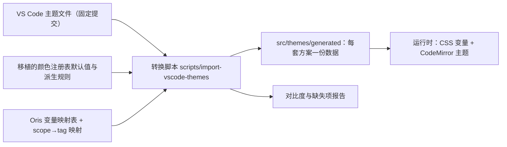

# Oris V2 技术方案

状态：工程设计。§1–§5、§7 已由任务 V2-01 实施（2026-09-24），实施中与本文不一致之处及原因见 [V2-01 结果](../validation/v2-01-results.md#与技术方案不一致之处)；§3 写通道、§4 OperationRunner 与 §6 中 stage / unstage / 丢弃（含备份）/ commit / amend / 撤销提交由任务 V2-02 实施（2026-09-24），差异见 [V2-02 结果](../validation/v2-02-results.md#与参考图和技术方案的差异)；其余章节尚未实施。主栈沿用 [V1 技术方案](v1-architecture.md)；本文描述二期的增量与修订。AI 提交辅助与统一操作入口（R-AI，V2-D66）的边界、执行与校验见 [AI 操作中心方案](ai-command-center.md)：AI 只返回结构化计划，Git 写入仍只经 §4 的 OperationRunner，设置仍只经 §9 的 SettingsStore。

## 1. 现状瓶颈（依据 2026-09-23 的 main 分支代码）

| # | 现状 | 影响 |
| --- | --- | --- |
| 1 | 每次快照刷新串行启动 4 个 Git 进程（`diff --name-status`、`ls-files --others`、`ls-files --unmerged`、`diff --numstat`），而且只覆盖一个比较范围（`git.rs` `list_changes` / `populate_stats`） | Windows 上 Git for Windows 每个进程要几十毫秒；切换比较范围时重新扫描。V1 实测 5 仓库 × 100 文件的未缓存重读 P50 为 663 ms |
| 2 | 内容读取经过全局 `READ_SERIAL` 互斥锁，所有仓库的读取排成一队（`lib.rs`） | 无法并行预取；一个慢仓库拖住所有仓库 |
| 3 | 每读一侧内容就启动一个 Git 进程 | 切换文件的时延被进程启动开销主导 |
| 4 | watcher 对整个 worktree 递归监听，每个事件都 emit 到前端，由前端做 300 ms 合并 | 构建、`node_modules` 安装时出现事件风暴，被忽略的路径也会触发刷新 |
| 5 | 普通读取带 `--no-optional-locks`，status 不回写 index 的 stat 缓存 | stat 信息变“脏”的文件每次刷新都要重新读取并计算哈希，大仓库会持续变慢 |
| 6 | 前端内容缓存以 `repo/scope/revision/path` 为键，revision 变化就清空整个仓库的缓存 | 任何 Git 操作之后，未变化文件的缓存也全部失效 |
| 7 | `App.tsx` 一个组件内有 30 多个 `useState` | 切换时大面积重渲染 |

## 2. 总体结构

```mermaid
flowchart LR
 UI[React：项目状态 store / 视图] -->|读请求| ReadAPI[读取 IPC]
 UI -->|写请求| OpAPI[操作 IPC]
 ReadAPI --> Snapshot[StatusScanner：status v2]
 ReadAPI --> Reader[ContentReader：cat-file --batch + 工作区读取]
 Reader --> BlobCache[OID Blob LRU]
 OpAPI --> OpRunner[OperationRunner：仓库级写锁 / 进度 / 取消]
 OpRunner --> WriteGit[写通道 Git 进程]
 Snapshot --> ReadGit[只读通道 Git 进程]
 Watch[Watcher：后端合并 + 忽略过滤 + 分类] --> Invalidate[分类失效事件]
 OpRunner -->|屏蔽窗口 / 精确刷新| Invalidate
 Invalidate --> UI
 Snapshot --> SnapStore[快照持久化：应用缓存目录]
```

## 3. 读写两条执行通道

- **只读通道**：保留 V1 的全部参数（`--no-optional-locks`、`core.fsmonitor=false`、禁用 external diff/textconv、`GIT_TERMINAL_PROMPT=0`、`GIT_LITERAL_PATHSPECS=1` 等）。浏览、刷新、切换只能走这个通道。
- **写通道**：只由 OperationRunner 调用，命令模板固定（见 §6），不接受前端传入任意参数。
  - 去掉 `--no-optional-locks`，允许使用 credential helper 与 ssh-agent，允许 hooks 与 LFS 等 filter 运行（与用户在终端执行 git 时的行为一致）。
  - 继续禁用 external diff/textconv，继续设置 `GIT_TERMINAL_PROMPT=0`。
  - **强制非交互**：所有需要消息的命令都通过 `-F -`（stdin）或 `--no-edit` 提供消息，同时把 `GIT_EDITOR`、`GIT_SEQUENCE_EDITOR` 设置为立即返回的空操作，防止任何命令卡在编辑器上。
  - **路径**：用 `--pathspec-from-file=- --pathspec-file-nul` 传递，避免命令行长度限制和特殊字符问题（Git ≥ 2.26，在最低版本 2.31 之内）。
  - **分支名**：先用 `git check-ref-format --branch` 校验，ref 解析为 OID 后再使用。
- 两条通道共用 Git 可执行文件发现与版本检测。`git --version` 的结果按“可执行文件路径 + mtime”缓存，不再每打开一个仓库都执行一次。

## 4. OperationRunner（写操作）

- **仓库级写锁**：同一仓库同时只运行一个写操作；另一个写请求直接拒绝（不排队），前端对应入口不可用。读取不受写锁阻塞，但操作期间产生的读结果会带上 revision，过期结果由 RequestGate 丢弃。
- **操作描述**：`{ kind, repoId, 模板参数, 确认等级, 影响维度 }`。影响维度为 `status` / `refs` / `head` / `stash` / `inProgress` 的组合，决定操作结束后刷新哪些部分。
- **watcher 屏蔽窗口**：操作开始时记录屏蔽标记，操作期间该仓库的 watcher 事件只做合并，不下发；操作结束后按影响维度做一次精确刷新，再解除屏蔽。
- **进度与取消**：pull、push、fetch 带 `--progress`，逐行解析 stderr，经 Tauri Channel 推送到前端。取消时终止整个进程树（Windows 使用 Job Object，macOS 使用进程组）。取消或失败之后，重新读取 refs 与 status，并如实报告实际状态。
- **超时**：网络操作设置“无输出超时”（初始 60 s）；hooks 不设超时，但可以取消。超时后终止进程，提示用户可能需要先在终端完成首次主机认证或凭据配置（V2-D12）。
- **外部锁**：检测到 `index.lock` 等锁文件导致的失败时，给出明确说明，不重试、不删除锁文件。显式 fetch 不需要 index，外部持有 `index.lock` 时照常执行（V2-D38）。
- **乐观更新**：stage、unstage 在前端立即移动条目，同时标记“确认中”；返回失败时回滚并提示。其他写操作不做乐观更新。
- **进行中状态检测**：读取 `MERGE_HEAD`、`rebase-merge/`、`rebase-apply/`、`CHERRY_PICK_HEAD`、`REVERT_HEAD`、`BISECT_LOG`，结果放进快照的 `inProgress` 字段。merge 以外的进行中状态会禁用全部写操作。
- **操作记录**：每个仓库只保留最近一次操作的完整输出（有字节上限），供状态栏展开查看，不写日志文件。凭据相关的输出在展示前做脱敏处理。

## 5. 数据层与流畅度

### 5.1 一次 status 覆盖三个比较范围

- 用 `git status --porcelain=v2 -z --branch --untracked-files=all --find-renames` 替换现有的 4 条命令。每个条目的 XY 状态分别对应“已暂存”（HEAD→index）和“未暂存”（index→工作区）；未跟踪（`?`）、冲突（`u`）各自独立；`--branch` 同时给出 HEAD OID、分支、上游、ahead/behind。
- 每个条目自带 HEAD 与 index 两侧的 OID，内容读取可以直接按 OID 取对象，不再需要按路径解析。
- **“全部本地改动”范围的 rename**：status v2 只识别 index 中的 rename（HEAD→index）。仅存在于工作区的 rename（未暂存删除 + 未跟踪新增）不会配对，而 V1 的 `diff HEAD --find-renames` 会配对。处理方式：只在显示“全部”范围时，懒执行一次 `diff HEAD --name-status -M -z` 修正配对，结果按 revision 缓存，保持与 V1 语义一致。
- **增删统计改为后台补齐**：文件列表先显示，统计随后用 `diff --numstat`（未暂存、已暂存两次，可并行）填充；“全部”范围的统计在首次显示时补齐。统计未到之前显示占位，不能显示为 0。
- **revision 重新定义**：仓库级 revision = hash(status v2 原始输出 + HEAD/refs 内容)，三个范围共享同一个 revision。切换范围不产生新的 Git 调用。

### 5.2 ContentReader

- 每个活跃仓库常驻一个 `git cat-file --batch` 进程（走只读通道参数），按 OID 读取 blob。进程生命周期：按需启动，空闲 60 s 关闭，全局最多 5 个（跟随项目 LRU）；进程异常退出时，下一次请求重新启动一次；重启仍失败则报告错误，不循环重试。
- 工作区一侧直接读取文件系统；用 `(size, mtime)` 快速判断文件是否变化，读取之后计算内容哈希作为 contentId。
- 去掉全局 `READ_SERIAL`，改为每个仓库一个读取队列：cat-file 天然串行，工作区读取的并发上限为 2。取消使用每个仓库独立的 generation 计数。
- 冲突 stage（V1 任务 03）的 OID 来自 status v2 的 `u` 条目，也经 ContentReader 读取，不再单独起进程。
- 大内容通过 `tauri::ipc::Response` 或 Channel 以二进制传输，避免 JSON 字符串转义造成的膨胀。

### 5.3 缓存分层

| 层 | 键 | 内容 | 上限（初始） | 失效方式 |
| --- | --- | --- | --- | --- |
| 后端 BlobCache | OID | blob 原始字节 | 全局 32 MiB，按字节 LRU；单个 blob > 4 MiB 不进缓存 | OID 是内容寻址，不需要失效，只做淘汰 |
| 前端 DiffCache | (leftContentId, rightContentId, 阅读选项) | DiffDocument 与解码后的文本 | 16 MiB / 12 项（沿用 V1） | 只做 LRU 淘汰；不再因 revision 变化整仓清空 |
| 项目轻量状态 | RepoId | 文件列表、锚点、分支、inProgress | 每项目 ≤ 2 MiB | 以快照 revision 为准 |
| 持久化快照 | RepoId | 同上（不含文件内容） | 每项目 ≤ 2 MiB，最多 20 个项目 | 启动时校验（§5.5） |

- 同一份内容不在后端和前端各留一份完整拷贝：后端只缓存 blob 字节；前端只缓存当前文件和预取文件的解码文本，以及 DiffDocument。
- Git 操作之后，内容未变化的文件的 contentId 不变，缓存继续命中。

### 5.4 Watcher

- 在后端合并事件（`notify-debouncer-full`，初始窗口 200 ms），只下发合并后的分类结果。
- 忽略过滤：打开仓库时加载 gitignore 规则（`ignore` crate），被忽略的路径直接丢弃；`.git/objects`、`.git/logs`、`*.lock` 临时文件也忽略。
- 事件分类与刷新动作：

| 事件来源 | 刷新动作 |
| --- | --- |
| 工作区路径 | status（事件路径少于阈值时，带 pathspec 做局部 status） |
| `.git/index` | status |
| `HEAD`、`refs/`、`packed-refs` | status 的 branch 头信息 + 分支 / 日志视图 |
| `refs/stash` | stash 列表 |
| `MERGE_HEAD` 等进行中标记 | inProgress 状态 |

- 后台项目：收到事件只标记 dirty，不刷新；切回前台时才刷新。watcher 最多保留 5 个项目（LRU），超出的项目关闭 watcher，切回时做完整 status。
- Oris 自己的写操作期间使用屏蔽窗口（§4）；stat 缓存回写（§5.6）产生的 index 事件也要识别并跳过。

### 5.5 快照恢复（再次打开）

- 每次成功扫描之后，把轻量状态（文件列表、OID、分支、inProgress、阅读锚点）写入应用缓存目录，采用版本化 JSON，写入失败时忽略。
- 启动时先显示持久化的快照，状态为“校验中”；后台执行 status，完成后按 pathId 比较差异并替换，保持当前阅读位置。校验完成前所有写入口不可用（V2-D08）。
- 快照中选中文件的 diff：HEAD/index 两侧按 OID 读取，工作区一侧重新读取，所以不会用旧内容冒充新内容。

### 5.6 stat 缓存与 fsmonitor

- **stat 缓存回写（V2-D09）**：只在两个时机执行一次不带 `--no-optional-locks` 的 `git status`，让 Git 回写 index：Oris 写操作结束之后（刷新时顺带进行），以及用户手动刷新时。watcher 与聚焦触发的刷新保持不写。回写产生的 `.git/index` 事件要跳过。
- **fsmonitor（V2-D10）**：读取 `core.fsmonitor` 配置，只有值为布尔 true 且 Git ≥ 2.37 时，不再强制 `core.fsmonitor=false`；值为命令字符串时继续禁用。V1 A13 的安全用例需要扩展覆盖这一分支。实施条件：L 数据集实测证明 status 是瓶颈。

### 5.7 前端

- 按项目拆分状态 store（基于 `useSyncExternalStore` 的小型 store，不引入状态管理库），视图订阅细粒度切片，切换项目时不重建整棵树。
- 全应用只有一个 diff 编辑器实例：切换文件时替换文档与装饰，不重建编辑器（与 V1 D15 的双 `EditorView` 结构兼容）。
- 预取：当前文件确定之后，空闲时预取列表中上下相邻各 1 个文件（仅限 ≤ 256 KiB 的文本）。
- 连续切换：键盘连续切换文件时，只立即更新选中高亮；内容请求延迟 80 ms 发出，新的切换会取消未发出的请求。
- 文件列表超过 500 项时启用虚拟列表；stash 列表、分支列表同样虚拟化。

## 6. 写操作命令模板

| 操作 | 命令（写通道；路径一律经 `--pathspec-from-file=- --pathspec-file-nul`） |
| --- | --- |
| stage / 标记已解决 | `add` |
| unstage | `restore --staged`；空 HEAD 时 `rm --cached` |
| 丢弃（未暂存，已跟踪） | 备份后 `restore --worktree` |
| 丢弃（未跟踪） | 备份后由 Rust 删除文件（路径校验在 worktree 内；符号链接只删除链接本身） |
| 丢弃（全部范围） | 备份后 `restore --source=HEAD --staged --worktree`；index 中新增的文件为 `rm --cached` 后删除 |
| 撤销丢弃 | 从备份对象写回工作区；暂存部分用 `update-index --cacheinfo` 恢复 |
| hunk 暂存 / 取消 / 丢弃 | Rust 按原始字节生成 patch，`apply --cached` / `apply --cached --reverse` / `apply --reverse`，执行前先 `--check` |
| commit | `commit -F -`（amend 已按 V2-D37 删除；“提交并推送”在前端于提交成功后再发起 push 请求） |
| 撤销最近提交 | `reset --soft HEAD~1`；根提交时 `update-ref -d HEAD` |
| stash 保存 | `stash push [-u] [-m] [-- <paths>]` |
| stash 应用 / 弹出 / 删除 | 先核对 `stash@{n}` 仍指向列表中的 OID，再执行 `stash apply` / `pop` / `drop` |
| 新建 / 切换分支 | `branch <name> <oid>`、`switch <name>`、`switch -c <name> --track <remote>/<branch>` |
| 检出提交 | `switch --detach <oid>` |
| 重命名 / 删除分支 | `branch -m`；`branch -d`，未合并时经确认后 `branch -D` |
| 设置上游 | `branch --set-upstream-to=<remote>/<branch>` |
| pull | `pull --no-rebase --ff-only --progress` 或 `pull --no-rebase --no-edit --progress`（遵循 `merge.ff`，能快进时快进，V2-D47），均带 `--no-recurse-submodules --no-autostash` |
| push | `push --progress`；首次为 `push --progress -u <remote> <branch>` |
| merge / 中止 / 完成 | `merge --no-edit [--no-ff] <oid>`、`merge --abort`、`commit -F -` |
| 已推送判断 | `merge-base --is-ancestor HEAD @{u}`（只读通道） |

### discard 备份

- 丢弃前对工作区内容执行 `hash-object -w`，把内容写入仓库对象库（这是写操作的一部分）；暂存内容本来就已在对象库中，只记录其 OID 和 mode。
- 备份记录（路径、OID、mode、时间、操作 ID）写入应用数据目录，每个仓库最多保留 20 次操作。恢复前用 `cat-file -e` 确认对象仍然存在；对象已被 gc 清理时如实说明。
- 单个文件超过 50 MiB 时不备份，确认框标注“不可撤销”。

## 7. 资源上限（初始值，由 V2-01 实测后固定）

| 资源 | 上限 |
| --- | --- |
| 常驻 `cat-file --batch` 进程 | 5 个，空闲 60 s 关闭 |
| watcher | 5 个项目（LRU） |
| 同时运行的写操作 | 每仓库 1 个 |
| 后端 BlobCache | 32 MiB |
| 前端 DiffCache | 16 MiB / 12 项 |
| 快照持久化 | 每项目 2 MiB，最多 20 个项目 |
| 操作输出保留 | 每仓库最近 1 次，256 KiB |
| discard 备份记录 | 每仓库 20 次操作；单文件 50 MiB |
| 配色方案数据 | 只加载当前使用的方案；跟随系统时额外预加载另一套 |

## 8. 安全边界

- V1 的 A13 用例继续有效：只读通道仍然不执行 external diff、textconv 或 fsmonitor 钩子命令。
- 写通道会执行 hooks 和 filter，与用户在终端中执行 git 的行为相同；这一点在发行说明中写明。
- 前端只能提交“操作描述”，Rust 负责参数构造、路径校验与 ref 解析，不提供通用的命令执行入口。
- 不保存凭据；操作输出展示前先脱敏（URL 中的用户名和密码）。
- 删除文件只允许发生在已校验的 worktree 路径内，不跟随符号链接。
- 工作区（§10）：`.gitmodules` 是仓库内容，视为不可信输入。只读取 `path` 与名称（`git config --file .gitmodules`，不读取 `url`、`update` 等字段），路径必须是相对路径、规范化后仍位于父仓库工作区内，否则忽略该条目并在选择器中说明。不执行任何 `git submodule` 子命令。

## 9. 设置与配色（任务 V2-06）

### 9.1 设置框架

- **SettingsStore**：一个带版本号的设置对象，按分类组织（`appearance`、`git`，以后按需增加）。设置写入应用数据目录，与项目列表使用同一种持久化机制；读取失败或版本不兼容时回退为默认值，并给出一次提示。
- **分类注册**：每个分类声明自己的设置项（键、类型、默认值、校验函数、界面控件）。设置窗口按注册表渲染，新增分类不需要改框架代码。
- **即时生效**：设置项变化后广播给订阅方（复用 V2-01 的小型 store），由订阅方增量更新，不整体重建界面。
- **迁移**：首次启动新版本时，把现有的逐项目 Git 路径迁移为全局设置（取最近一次成功打开的项目所用的非空路径）；字号、浅深色原来没有持久化，使用默认值。旧的逐项目字段保留读取兼容，但不再写入。
- **Git 路径校验**：修改后在后端执行一次 `git --version` 校验，并复用 §3 的“可执行文件 + mtime”缓存；校验失败时保留原来的有效值。新路径对之后的 Git 调用生效；已打开项目的常驻 `cat-file` 进程在下一次空闲回收后，使用新路径重新启动。

### 9.2 配色流水线

```mermaid
flowchart LR
 VS[VS Code 主题文件（固定提交）] --> Conv[转换脚本 scripts/import-vscode-themes]
 Reg[移植的颜色注册表默认值与派生规则] --> Conv
 Map[Oris 变量映射表 + scope→tag 映射] --> Conv
 Conv --> Gen[src/themes/generated：每套方案一份数据]
 Conv --> Report[对比度与缺失项报告]
 Gen --> Runtime[运行时：CSS 变量 + CodeMirror 主题]
```

- 转换脚本解析 JSONC 与 `include` 继承链，用移植过来的注册表默认值（按 dark / light / hcDark / hcLight 区分，只移植映射表里用到的键）补齐缺失项，支持透明度、变亮、变暗这几种派生运算，然后输出 Oris 格式的方案数据。生成结果与来源提交、许可信息一起提交入库；运行时不解析 VS Code 格式的文件。
- 同一来源提交重复运行，输出必须逐字节一致。
- 运行时按需加载当前使用的方案数据；“跟随系统”模式下预加载另一套方案，保证系统切换时能立即生效。

### 9.3 Oris 颜色变量映射（初版，由 V2-06 补全）

| Oris 用途 | VS Code 颜色键（按顺序回退） |
| --- | --- |
| 主背景 / 编辑器背景 | `editor.background` |
| 侧栏、面板 | `sideBar.background` → `panel.background` → `editor.background` |
| 标题栏、项目栏 | `titleBar.activeBackground` → `editorGroupHeader.tabsBackground` → `sideBar.background` |
| 正文 / 次要文字 / 行号 | `editor.foreground` → `foreground`；`descriptionForeground`；`editorLineNumber.foreground` |
| 分隔线 | `panel.border` → `sideBar.border` → `editorGroup.border` → `contrastBorder` |
| 列表悬停 / 选中 | `list.hoverBackground`；`list.activeSelectionBackground` + `list.activeSelectionForeground` |
| 焦点与强调色 | `focusBorder` → `button.background` |
| 按钮 | `button.background` / `button.foreground`；`button.secondaryBackground` / `button.secondaryForeground` |
| 输入框、下拉框 | `input.*` → `dropdown.*` |
| 开关开启态 | `inputOption.activeBackground` / `inputOption.activeBorder` |
| 状态栏 | `statusBar.background` / `statusBar.foreground` |
| 文本选中 / 同词匹配 / 搜索命中 | `editor.selectionBackground`；`editor.selectionHighlightBackground`；`editor.findMatchBackground` / `editor.findMatchHighlightBackground` |
| 警告 / 错误 | `editorWarning.foreground`；`errorForeground` |
| 文件状态字母 | `gitDecoration.*ResourceForeground` |
| 滚动条 | `scrollbarSlider.*` |
| 弹层阴影 | `widget.shadow` |
| diff（P-V2-05 方案 A） | 修改：`editorGutter.modifiedBackground` 按统一透明度生成行底色与词级底色；新增：`diffEditor.insertedLineBackground` / `insertedTextBackground`，缺失时由 `editorGutter.addedBackground` 生成；删除：`editor.foreground` 与 `editor.background` 混合出中性灰；外缘色标列用 `editorGutter.*` |

- 高对比类型额外使用 `contrastBorder` / `contrastActiveBorder`，界面切换到“描边代替底色”的样式分支。
- 语法高亮：TextMate scope → Lezer tag 映射表按最长前缀匹配取色，生成 CodeMirror `HighlightStyle`；替换现在的 `@codemirror/theme-one-dark`。

### 9.4 运行时应用

- 界面颜色全部改为 CSS 变量。V2-06 首先把 `styles.css` 中写死的颜色（调研时 117 处十六进制值）收拢为变量；此后新增界面不得写死颜色（加一条静态检查）。
- diff 阅读器的配色与字号放进 CodeMirror `Compartment`，切换时 `reconfigure`，不重建 `EditorView`。当前 `DiffViewer` 在 `dark`、`fontSize` 变化时整体重建，需要改掉。
- 首屏无闪烁：`index.html` 中用一小段同步脚本读取已保存的方案标识与主题模式，在 React 挂载前写入根元素的类名和关键变量；跟随系统时读取 `prefers-color-scheme`，并监听变化（必要时辅以 Tauri 窗口主题事件）。
- 图片阅读器的棋盘格背景、对话框、横幅统一使用变量。

## 10. 工作区（任务 V2-07，R-WORKSPACE）

### 10.1 现状与改动面（依据 2026-09-29 的 main 分支代码）

- 仓库身份已经按仓库隔离：`GitAdapter::open` 用 `rev-parse --show-toplevel` 取工作区根，`repo_id` 是根路径的哈希。子模块、worktree 各自有独立的 repoId，因此快照、ProjectRuntime、写锁、提交草稿、操作输出、discard 备份都可以直接按成员复用，不需要改读写通道。
- 需要改动的是四处：项目记录（一条记录对应多个仓库）、项目发现（添加时识别工作区与归属）、status 参数（子模块指针开关）、watcher（共用与分派）。
- 命名：代码中的 `WorkspaceState` / `oris.workspace.v2` 已经表示“整个项目列表”。新概念在代码中称为 **RepoGroup**（成员为 `GroupMember`），界面文字仍为“工作区”，避免两个“workspace”混用。

### 10.2 发现与归属

后端新增只读命令 `discover_group(path)`，全部走只读通道（§8 的只读约束）：

1. `rev-parse --show-toplevel --absolute-git-dir --git-common-dir --show-superproject-working-tree`。
2. **归属**：`--show-superproject-working-tree` 非空，说明所选目录是子模块，改为以父仓库为工作区（V2-D79）；子模块的 linked worktree 不会报告父仓库，改用 common dir 判断：common dir 位于 `<某仓库>/.git/modules/<名称>` 之下时，以该仓库为父仓库，并用父仓库的 `.gitmodules` 核对名称。父仓库本身也是子模块时（子模块的子模块），按普通项目处理。
3. **成员**：
   - 子模块：`git config --file .gitmodules --null --get-regexp '^submodule\..*\.path$'`，按 §8 校验路径；是否初始化：`<path>/.git` 存在且在该目录下 `rev-parse --show-toplevel` 等于该路径。
   - 父仓库记录的指针：一次 `ls-files -s -z -- <全部子模块路径>`，取 mode 160000 的 OID。
   - worktree：对父仓库和每个已初始化的子模块执行 `worktree list --porcelain -z`，目录不存在的（prunable）标为缺失。
   - 手动加入的独立嵌套仓库：来自项目记录，打开时重新校验仍是独立仓库且位于工作区内。
4. 返回 `{ root: RepositoryInfo, members: GroupMember[] }`。`GroupMember = { repoId?, kind: "superproject" | "submodule" | "worktree" | "manual", name, path, parentRepoId?, state: "ready" | "uninitialized" | "missing" | "invalid", recordedOid?, headOid?, branch? }`。未初始化、缺失的成员没有 repoId，不打开 GitAdapter。

### 10.3 项目记录与迁移

- `ProjectRecord` 增加 `group?: { activeRepoId: string; members: MemberRecord[] }`，`MemberRecord = { repo: RepositoryInfo; anchor: ReadingAnchor; customName?: string; manual?: boolean; showSubmodulePointers?: boolean }`。普通项目没有 `group` 字段，行为不变。
- 存储版本升到 3：v2 记录原样读入（没有 `group`）；写入 v3。回退到旧版本时，旧版本只认识外层 `repo`，工作区会退化为只打开父仓库，不丢数据。
- 合并（V2-D79）：添加工作区或识别出归属时，在同一次 `upsertProject` 里把 `repoId` 属于成员的独立项目移入 `group.members`（保留 `customName`、`anchor`），并从项目列表中删除；工作区占用父仓库原来的位置，父仓库原来不在列表中时占用第一个被并入成员的位置。提交草稿、快照、同步默认方式本来就按 repoId 保存，不需要迁移。
- `activeRepoId`（外层，项目栏选中项）保持为工作区父仓库的 repoId；当前仓库由 `group.activeRepoId` 决定。前端所有按 repoId 取状态的地方改为取“当前项目的当前仓库 repoId”，集中在一个选择函数里，避免散落的判断。

### 10.4 status 与子模块指针

- `scan.rs` 与 `status_v2.rs` 的 status 参数增加 `--ignore-submodules=all`（开关关闭）或 `--ignore-submodules=dirty`（开关打开），由调用方按仓库传入（V2-D80）。不含子模块的仓库不传，保持现状。
- 这一参数同时解决性能问题：不设 `ignore` 的仓库，原来的 status 会进入每个子模块检查工作区改动；两种取值都不会。
- 指针行复用现有 gitlink 条目（`media.rs` 的 `SubmoduleInfo`），文件列表中显示为“子模块 name：a → b”，并带“切换到该仓库”动作（按路径在成员中查找 repoId）。暂存 / 取消暂存走现有文件级通道；discard、hunk 继续按 V2-D55 / R-DISCARD 禁用。
- 嵌套仓库目录（V2-D81）：porcelain v2 对未跟踪的嵌套仓库只报告一条以 `/` 结尾的目录记录。扫描后按“路径是成员根，或目录下存在 `.git`”把这些记录从文件列表移到 `nestedRepos` 字段，前端在列表底部折叠显示。判断 `.git` 只对 `?` 类型且以 `/` 结尾的记录做，不遍历目录。

### 10.5 Watcher 共用与分派

- 一个工作区只建一个递归 watcher，监听父仓库工作区根；工作区外的 worktree 与 Git 目录（例如放在别处的 linked worktree）另加非递归或递归监听，登记在同一个 `GroupWatcher` 下，在 `WatchLru` 中只占一个名额（V2-D82）。
- 分派：为每个就绪成员登记 `(worktree 根, git_dir, common_dir)`，事件路径按最长前缀找到所属成员后，交给该成员自己的 `IgnoreRules` 与 `classify`。父仓库的 `.git/modules/<name>` 属于对应子模块的 Git 目录，最长前缀天然把它分给子模块。
- 刷新：当前仓库照常刷新；其他成员（包括未选中时的父仓库）只把 `ProjectRuntime.dirty` 置位，徽标显示“有变化”，切换过去时刷新。父仓库 `.gitmodules` 或各仓库 `worktrees/` 登记目录变化时，重新执行一次 `discover_group`。
- Windows 上的 ReadDirectoryChangesW 无法在系统层排除子目录，子仓库目录中的事件仍会送达，只是在分派后按子仓库规则过滤（子仓库的 `.gitignore`，例如 Unity 的 `Library/`），不会让父仓库重扫。这部分过滤开销由 B36 测量。

### 10.6 徽标与资源

- 打开工作区时：`discover_group` 已经给出分支、HEAD 与记录的指针，偏离即 `headOid != recordedOid`。
- 改动数：打开选择器或手动刷新时，对尚未扫描或 dirty 的成员执行一次只读 status（与正常扫描相同的参数），最多同时 2 个，结果只写入该成员的轻量状态，不预读 diff 内容（V2-D83）。
- 成员的 GitAdapter 只在第一次切换过去时创建；切走后常驻 `cat-file` 按现有空闲回收。空闲时常驻 Git 子进程 ≤ 5 的上限（验收 §4）对整个应用生效，工作区不另开额度。
- 快照持久化按 repoId 计数，工作区的每个已打开成员各算一个，仍受“每项目 2 MiB，最多 20 个”的上限约束；超出时优先淘汰其他项目中最久未用的成员快照。

### 10.7 前端

- 标题栏的仓库选择器与项目搜索共用一套列表组件（搜索、键盘上下选择、Enter 切换、Esc 关闭）；成员按“父仓库 → 子模块（按 `.gitmodules` 顺序）→ 手动加入”排列，worktree 缩进在所属仓库下。
- 切换成员与切换项目走同一条路径：替换当前 repoId，立即显示该成员的 ProjectRuntime 快照，dirty 时后台刷新（R-FLOW“切换项目”预算同样适用）。
- 历史中的 gitlink 条目（V2-D85）：跳转时先切换成员，再用现有的“比较两个版本”入口打开 a ↔ b；任一提交在子仓库中不存在（`cat-file -e` 失败）时说明“该子仓库中还没有这个提交，可以先获取”，不自动获取。

### 10.8 实施说明（2026-09-29，任务 V2-07）

实现与上文不一致之处及原因（验收结果见 [V2-07 结果](../validation/v2-07-results.md)）：

- **项目记录（§10.3）**：没有把成员嵌套进父仓库记录，改为每个成员仍是一条普通 `ProjectRecord`，带 `groupId`；父仓库记录带 `group: { lastRepoId, manual }`；项目栏只显示没有 `groupId` 的记录。这样阅读锚点、别名、提交草稿、快照、写锁都按 repoId 复用，切换成员直接走项目切换。存储版本仍为 v2（新增字段均可选）：退回旧版本时成员显示为独立项目，不丢数据。
- **嵌套仓库目录（§10.4）**：过滤对所有仓库生效，不只工作区——嵌套仓库目录作为“未跟踪文件”没有可读内容，普通项目中也在列表底部说明。
- **子模块两侧提交**：扫描为 gitlink 条目带上 `submodule: { old, new }`（已暂存 HEAD → index，未暂存 index → 子模块当前 HEAD，全部 HEAD → 当前 HEAD）；子模块 HEAD 用 `media::submodule_head` 只读文件得到，不启动 Git。历史中的 gitlink 条目改由 `diff-tree --raw` 得到两侧提交。
- **监听（§10.5）**：新增 `ChangeKind::Members`（`.git/worktrees/<名称>`、`.git/modules/<名称>` 这一层的新增 / 删除），前端据此重新发现成员；只含该类事件时不刷新当前仓库。linked worktree 与主仓库共用 common dir，其中的事件两者都收到（与单仓库 watcher 同时监听 git dir 与 common dir 的行为一致）。
- **worktree 就绪判断（§10.2）**：只有解析出的工作区根正好等于登记路径才算就绪。真实工作区中有停在 `locked initializing` 的 worktree，目录还在但 Git 会向上找到所属仓库，不加这条会把所属仓库重复列出。与所属仓库同名的 worktree 名称带上级目录；选择器中同一仓库两个及以上不可用的 worktree 合并成一行。
- **子模块指针开关**：切换后直接重新扫描当前仓库，不走受前台状态约束的自动刷新。
- **历史页挂载**：只在当前仓库已在后端打开后挂载（首次切到的成员此前会先报“仓库尚未打开”），父仓库历史跳来的比较在打开后执行，离开该子仓库后清除请求。
- **当前仓库意图**：新增 `activeIntent`，切换或接受快照时同步更新；自动刷新开始前与结果返回后核对，闭包捕获的仓库已过期时延后。修复一个既有竞态：当前仓库刚改变、界面尚未重新渲染时，“回到前台”计时器按旧仓库刷新并把它设回当前仓库。
